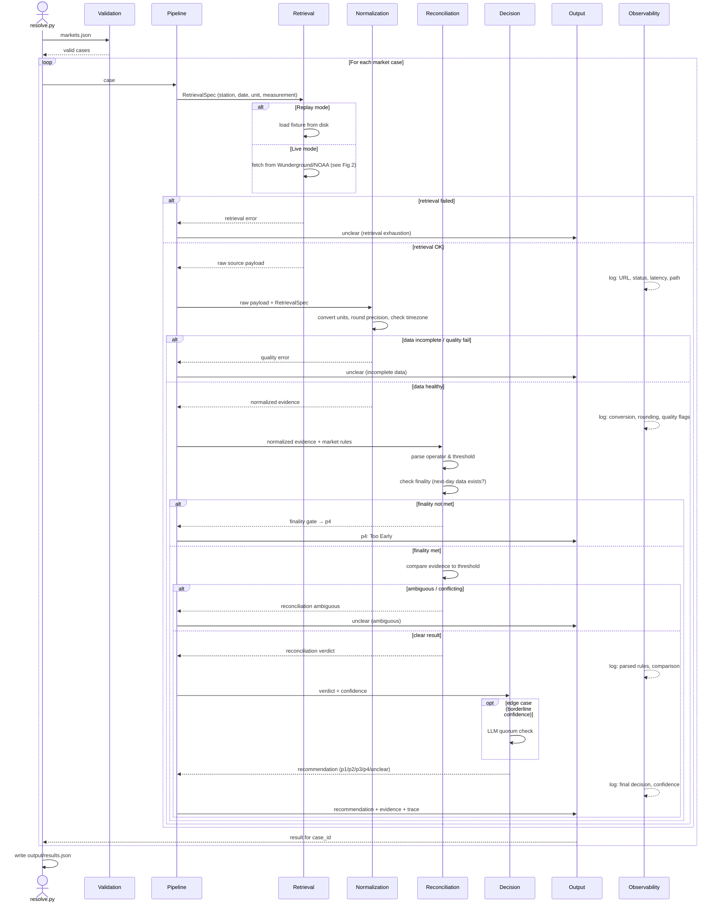
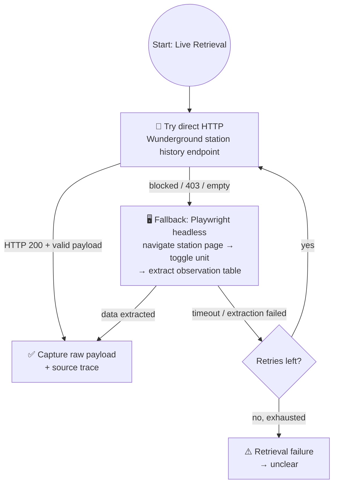

# OTB Weather Market Resolver — Design Document

## Architecture Overview

The resolver is a linear pipeline: **Retrieval → Normalization → Reconciliation →
Decision → Output**. Each stage transforms data and hands off to the next. An
Observability layer logs every stage independently. Each market case flows
through the same pipeline.

### Main Pipeline (Sequence Diagram)

A sequence diagram shows the temporal flow better than a flowchart — each
participant is a stage, arrows carry data, and the Observability logger is a
parallel lane that records everything without interfering with the main flow.



### Retrieval Strategy (Focused Flowchart)

The only part of the pipeline with meaningful branching is retrieval. This
flowchart shows the fallback chain: API → Playwright → exhaustion → `unclear`.



Replay mode skips this entirely — it loads a pre-captured fixture from
`data/fixtures/` by `case_id` and feeds the raw payload directly into
Normalization.

## Pipeline Stages — Detailed Semantics

### 0. Input & Validation
- Load `markets.json`, validate against schema (`data/schema/market_input.schema.json`)
- Fail fast on schema violations — do not partially process
- Each market case is loaded into an immutable data structure

### 1. Compose Retrieval Spec
Parse `ancillary_data` to extract:
- **Station URL**: exact Wunderground/NWS URL (never infer from city name)
- **Target date**: from `question_data.end_date_iso` or ancillary data
- **Measurement type**: daily high, daily low, or monthly precip total
- **Unit**: Celsius or Fahrenheit (verify against URL, not assumption)
- **Precision**: whole degrees (temp) or 2 decimals (precip)
- **Finality date**: target date + 1 day (for next-day datapoint check)

### 2. Retrieval (with Fallback Loop)
Two modes:
- **Replay**: Load pre-captured fixture by `case_id` from `data/fixtures/`. Deterministic.
- **Live**: Multi-strategy fetch with fallback:
  1. **Primary**: Direct HTTP to Wunderground's internal station history JSON endpoint (e.g., reverse-engineered API)
  2. **Fallback**: Playwright headless browser → navigate station page → toggle correct unit → extract observation table
  3. **Exhaustion**: After retries + fallback exhaustion → `unclear`

Every retrieval records: exact URL, timestamp, HTTP status, response bytes, path taken (api/playwright), errors, latency.

### 3. Normalization
Transform raw data into market-comparable values:
- **Unit conversion**: °C ↔ °F using exact formulas; record provenance
- **Precision**: Round to whole degrees (temp) or 2 decimals (precip) per market spec
- **Timezone**: Station's local day boundary (from station metadata or tz lookup), never UTC
- **Quality check**: Flag missing observations, intraday readings mislabeled as daily values, anomalous values. Incomplete → `unclear`.

### 4. Reconciliation
Match normalized evidence to parsed market rules:

#### 4a. Parse Market Rules
Extract from `title` + `ancillary_data`:
- **Comparison operator**: exact match (`==`), threshold (`≥`, `≤`), range (`between X-Y`)
- **Threshold value(s)**: e.g., `20°C`, `68-69°F`, `29°C or higher`
- **Tie/ bracket behavior**: from ancillary data `res_data` field

Examples:
| Question pattern | Operator | Value(s) |
|---|---|---|
| "be 20°C on June 1?" | exact (==) | 20 |
| "be 29°C or higher?" | ≥ | 29 |
| "be 22°C or below?" | ≤ | 22 |
| "between 68-69°F?" | range (∈) | [68, 69] |

#### 4b. Finality Gate (Critical)
- Retrieve at least one observation timestamp for date+1 from the same station
- If next-day data does not exist → **p4 (Too Early)**, bypass all further logic
- This is the first reconciliation check — nothing else matters before finality

#### 4c. Evidence-to-Rules Comparison
- Compare normalized observation to parsed threshold using parsed operator
- If comparison is clear-cut → produce reconciliation verdict (Yes/No)
- If data is incomplete, ambiguous, or conflicting → `unclear`

### 5. Decision
Produce the final recommendation:
- **Rule-based path** (most cases): Direct mapping from reconciliation verdict + confidence score
- **LLM quorum path** (edge cases): When rule-based confidence is borderline, invoke 2-3 LLM providers in parallel; require majority consensus; if no consensus → `unclear`
- **Conservative default**: A wrong confident p1/p2 is worse than `unclear`. When in doubt, return `unclear`.

Confidence scoring:
- **0.9–1.0**: Direct API response, clear comparison, all quality checks pass
- **0.7–0.9**: Playwright fallback, or some data quality flags (but resolvable)
- **0.5–0.7**: Ambiguous parsing, unit inference required, edge case
- **< 0.5**: Not resolvable → `unclear`

### 6. Output Formatting
Each case produces:
```json
{
  "case_id": "tokyo_low_2026_06_01_20c",
  "recommendation": "p1",
  "confidence": 0.95,
  "evidence": {
    "station": "RJTT (Tokyo Haneda)",
    "date": "2026-06-01",
    "measurement": "daily_low",
    "value_c": 18,
    "value_raw": "18°C",
    "unit": "C"
  },
  "source_trace": {
    "primary_url": "https://www.wunderground.com/history/daily/jp/tokyo/RJTT/date/2026-06-01",
    "retrieval_path": "api",
    "http_status": 200,
    "retrieved_at": "2026-07-08T12:00:00Z",
    "latency_ms": 234,
    "errors": null
  },
  "reasoning": "Tokyo Haneda (RJTT) recorded a daily low of 18°C on June 1 2026. The market asks whether the low was exactly 20°C. 18 ≠ 20, therefore p1 (No).",
  "review_reason": null
}
```

### 7. Observability (Cross-Cutting)
Every pipeline stage emits structured telemetry:
- **Retrieval**: URL, method, status, latency, retries, path taken
- **Normalization**: raw value → normalized value, conversion formula, rounding decision
- **Reconciliation**: parsed rules, finality check result, comparison outcome
- **Decision**: final recommendation, confidence breakdown, LLM providers consulted

Telemetry is JSON-lines for production, human-readable for dev.
Enables: dashboards, replay reports, silent source degradation detection.

## Key Design Decisions

### Why retrieval retries but reconciliation does not loop back
- Retrieval failures are transient (network, blocking) → retry with fallback makes sense
- Reconciliation ambiguity is about data quality, not network → retrying the same source won't fix missing/conflicting data → `unclear` is the correct answer
- Looping reconciliation → retrieval would create non-deterministic behavior

### Why finality comes before threshold comparison
- Per market rules, the market *cannot* resolve before next-day data exists
- Checking finality requires a retrieval (of date+1), but the result gates everything
- If finality fails, we save the work of normalization and comparison

### Why LLM quorum is optional and late-stage
- Most weather markets are deterministic: number vs threshold
- LLMs add latency, cost, and non-determinism
- Only invoke for edge cases where rule-based confidence is borderline
- Quorum (2+ models agreeing) reduces single-model hallucination risk

## File Organization (Design-Time View)

```
src/
├── pipeline.py            # Orchestrator: wires stages together, runs per-market loop
├── validation.py          # Schema validation for markets.json
├── retrieval/
│   ├── spec.py            # Compose RetrievalSpec from ancillary_data
│   ├── replay.py          # Load fixtures from data/fixtures/
│   ├── live.py            # Live fetch orchestrator
│   ├── wunderground_api.py # Direct HTTP strategy
│   ├── wunderground_playwright.py # Headless browser fallback
│   └── noaa.py            # NOAA/NWS monthly data (precip markets)
├── normalization/
│   ├── units.py           # °C ↔ °F conversion
│   ├── precision.py       # Rounding to market-specified precision
│   ├── timezone.py        # Station local day handling
│   └── quality.py         # Data quality / completeness checks
├── reconciliation/
│   ├── rule_parser.py     # Extract operator + threshold from question text
│   ├── finality.py        # Next-day datapoint existence check
│   └── comparator.py      # Apply operator to normalized evidence
├── decision/
│   ├── resolver.py        # Rule-based decision engine
│   ├── confidence.py      # Confidence scoring
│   └── quorum.py          # Multi-model LLM quorum for edge cases
├── models/
│   └── providers.py       # LLM provider abstraction (OpenAI, Anthropic, etc.)
├── observability/
│   └── telemetry.py       # Structured logging + trace emission
└── output/
    └── formatter.py       # Compose output JSON per schema
```

## Implementation Roadmap

### Phase 1: Skeleton + Validation (Day 1)
- [ ] Project scaffolding: `src/`, `tests/`, `data/schema/`
- [ ] Input schema (`market_input.schema.json`) and validation
- [ ] Output schema (`resolution_output.schema.json`)
- [ ] CLI entry point (`resolve.py`) with argparse
- [ ] Per-market loop skeleton in `pipeline.py`

### Phase 2: Retrieval Spec + Replay Mode (Day 1-2)
- [ ] `RetrievalSpec` dataclass — parse ancillary_data into structured spec
- [ ] Fixture loader — map case_id to fixture file, load raw payload
- [ ] Replay mode end-to-end (no normalization yet): load fixture → pass through

### Phase 3: Normalization (Day 2)
- [ ] Unit conversion with provenance tracking
- [ ] Precision rounding per market rules
- [ ] Timezone handling (station local day)
- [ ] Data quality checks (missing, partial, anomalous)

### Phase 4: Reconciliation (Day 2-3)
- [ ] Rule parser: extract operator and threshold from title + ancillary_data
- [ ] Finality gate: check next-day datapoint existence
- [ ] Comparator: apply operator to normalized evidence
- [ ] Unit tests for each operator type and edge cases

### Phase 5: Decision + Output (Day 3)
- [ ] Rule-based resolver: map reconciliation verdict → p1/p2/p3/p4/unclear
- [ ] Confidence scoring heuristic
- [ ] Output formatter (structured JSON per case)
- [ ] End-to-end replay mode complete

### Phase 6: Live Retrieval (Day 3-4)
- [ ] Wunderground API strategy (reverse-engineer history endpoint)
- [ ] Playwright fallback strategy
- [ ] Retry + fallback loop with exhaustion handling
- [ ] Live mode snapshot recording (for future replay)
- [ ] End-to-end live mode

### Phase 7: LLM Quorum (Day 4-5)
- [ ] Provider abstraction layer (OpenAI, Anthropic)
- [ ] Quorum logic (parallel calls, majority consensus, no-consensus → unclear)
- [ ] Integration: invoke only for borderline confidence cases

### Phase 8: Observability + Telemetry (Day 5)
- [ ] Structured JSON-lines logging
- [ ] Per-step trace emission
- [ ] Summary report (success rate, unclear rate, source failures)

### Phase 9: Evaluation + Polish (Day 5-6)
- [ ] `evaluate.py`: compare predictions vs gold answers
- [ ] Edge case test suite
- [ ] README with complete operator instructions
- [ ] DESIGN.md (this document) finalization

### Phase 10: Bonus — Live OTB Mode (Day 6-7)
- [ ] Poll Oracle API for proposed Weather markets
- [ ] Run same pipeline on live proposals
- [ ] Paper-propose recommendations (no settlement)

## Failure Modes & Conservatism

| Scenario | Resolution |
|---|---|
| Fixture missing for case_id in replay mode | `unclear` — cannot resolve without data |
| Wunderground API blocked (no Playwright) | `unclear` — retrieval exhaustion |
| Playwright times out after retries | `unclear` — retrieval exhaustion |
| Next-day data not yet published | `p4` — finality gate |
| Station returns partial day (only morning readings) | `unclear` — incomplete data |
| Wunderground returns intraday point as "daily high" | Quality check should flag; `unclear` if ambiguous |
| Units ambiguous (ancillary says °C, station shows °F) | Reconcile explicitly; `unclear` if conflict unresolvable |
| LLM providers disagree (no quorum) | `unclear` — conservative on disagreement |
| Question wording doesn't match known patterns | `unclear` — rule parser can't extract operator |
| Ancillary data has bulletin board update changing rules | Parse update; apply revised rules; log the change |
